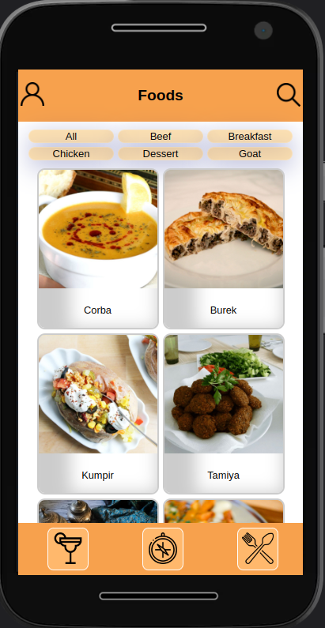
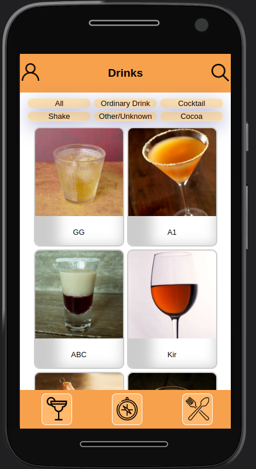

<h1>Sobre</h1>

Último projeto do módulo 2 - Front-end, da <a href="https://betrybe.com" target="_blank">Trybe!</a>

Nosso terceiro projeto em grupo! Contei com a ajuda de <a href="https://github.com/daxjunior36" target="_blank">Domingos Alexandre</a>, <a href="https://github.com/LeticiaDePaula" target="_blank">Leticia de Paula</a>, <a href="https://github.com/Ladylane" target="_blank">Ladylane de Sousa</a> e <a href="https://github.com/MarcilioamiL" target="_blank">Marcilio Lima</a>

A proposta foi criar uma aplicação completa de receitas de comidas e bebidas. Além disso era possível explorar por ingredientes e nacionalidades.

Ultizamos as API's https://www.themealdb.com/ e https://www.thecocktaildb.com/

<h1>Instalando</h1>

Para instalar, basta executar o comando <code>npm install</code> no diretório raiz do projeto.

Logo depois execute o comando <code>npm start</code>

<h1>Tecnologias utilizadas</h1>

<ul>
  <li>React</li>
  <li>React Router</li>
  <li>Context API</li>
  <li>Styled Components</li>
</ul>

<h1>Aplicação</h1>

 

